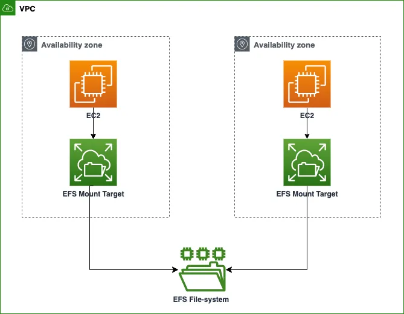
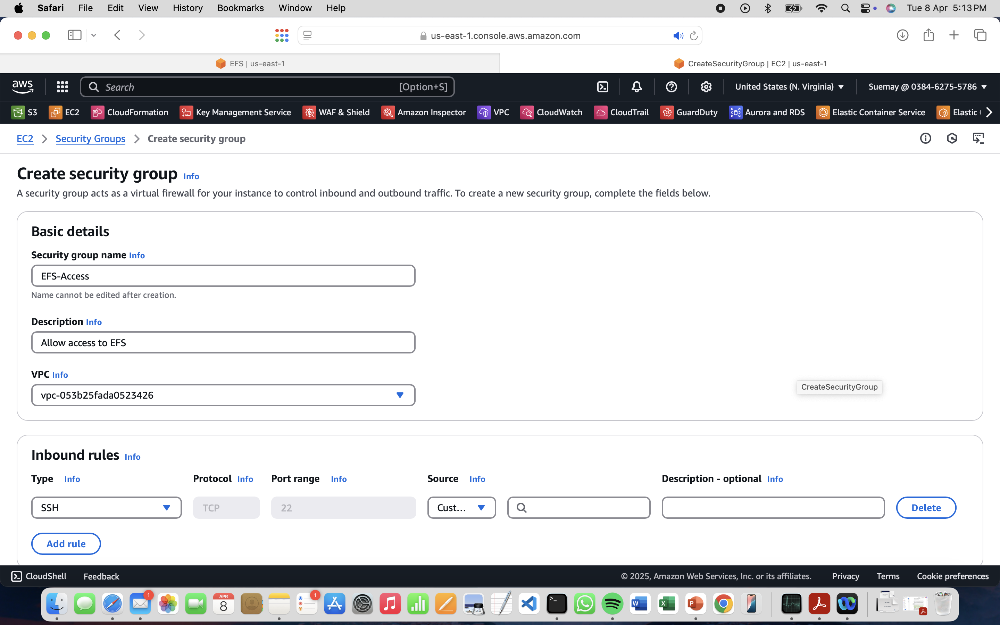
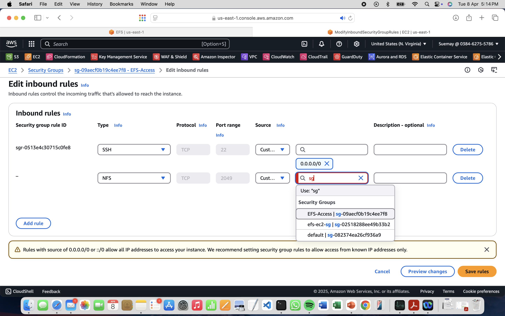

```markdown
# Mounting EFS File Systems to EC2 Instances Across Availability Zones

This project demonstrates how to mount an Amazon Elastic File System (EFS) to two EC2 instances located in different Availability Zones (AZs) within the same region. It ensures shared file access between the EC2 instances using EFS.

## Architecture Overview

- **EFS File System**: Shared storage across EC2 instances
- **EC2 Instances**: Two instances in different AZs (e.g., `us-east-1a` and `us-east-1b`)
- **Security Group**: Allows SSH and NFS access for EFS mounting

 
---

## Prerequisites

- AWS account with permissions to create EC2, EFS, and security groups
- Default VPC and subnets across AZs
- Basic understanding of Linux commands

---

## Step-by-Step Instructions

### 1. Create a Security Group for EFS Access

1. Go to the **EC2 Management Console** → **Security Groups**
2. Create a new security group:
   - **Name**: `EFS-Access`
   - **Description**: `Allow access to EFS`
   - **VPC**: Default VPC
3. Add the following **inbound rule**:
   - Type: `SSH`, Protocol: `TCP`, Port: `22`, Source: `My IP`
4. Save the security group.


5. Edit the inbound rules again to add:
   - Type: `NFS`, Protocol: `TCP`, Port: `2049`, Source: `EFS-Access` (self-reference)

---

### 2. Launch EC2 Instances in Different AZs

Repeat the steps below for two instances:

1. Go to **EC2 Console** → **Launch Instance**
2. Select:
   - **Amazon Linux 2 AMI**
   - **Instance Type**: `t2.micro` (Free Tier)
3. Click **Edit Networking**:
   - Choose a subnet from AZ (e.g., `us-east-1a` for first instance, `us-east-1b` for second)
   - Attach the previously created **EFS-Access** security group
4. Launch both instances

---

### 3. Create the EFS File System

1. Navigate to the **EFS Console** → **Create File System**
2. Name the file system: `MyEFSFilesystem`
3. Choose **Customize** and uncheck:
   - `Enable automatic backups`
4. Leave the rest of the settings as default and create the file system

---

### 4. Mount EFS on EC2 Instances

#### Connect to Each EC2 Instance

1. Use **EC2 Instance Connect** or SSH
2. Run the following commands on **both EC2s**:

```bash
# Update system packages
sudo yum -y update

# Create mount point
mkdir ~/efs-mount-point

# Install EFS utilities
sudo yum install -y amazon-efs-utils
```

#### Mount the EFS File System

1. Go to **EFS Console** → **Attach**
2. Copy the EFS mount command using EFS mount helper (e.g.):

```bash
sudo mount -t efs -o tls fs-xxxxxxx:/ ~/efs-mount-point
```

3. Paste and run the command on both EC2s.

---

### 5. Test Shared File Access

On one EC2:

```bash
cd ~/efs-mount-point
mkdir testdirectory
touch testdirectory/testfile.txt
```

On the second EC2:

```bash
cd ~/efs-mount-point
ls testdirectory
# You should see: testfile.txt
```

---

## Conclusion

This setup successfully demonstrates mounting a shared EFS file system to EC2 instances across multiple Availability Zones for high availability and scalability.

---
